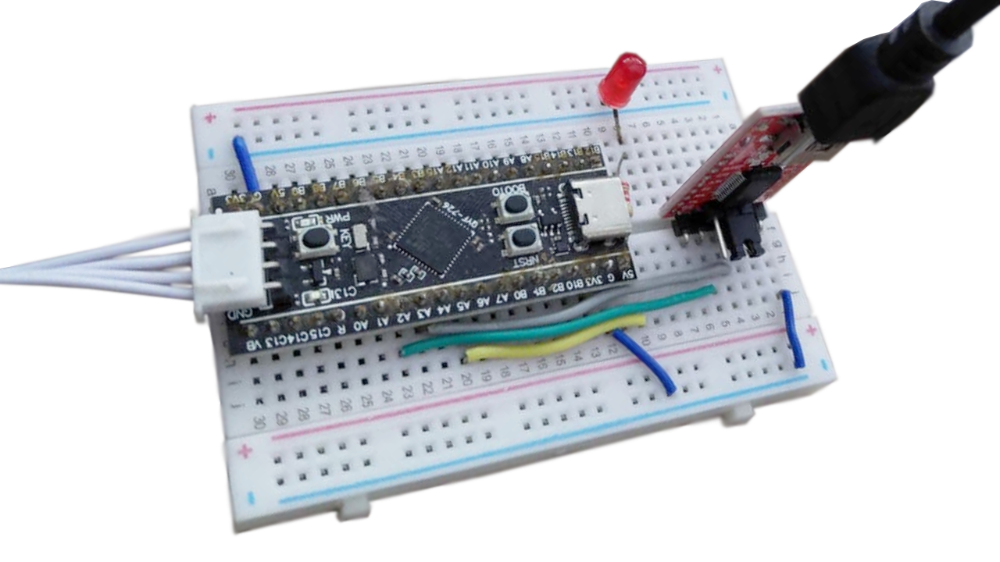

# F411 Sandbox



```bash
mkdir build && cd build
cmake ..
make

mkdir build && cd build
cmake -DCMAKE_TOOLCHAIN_FILE=../cmake/arm-none-eabi-gcc.cmake ..
cmake --build .
```

---

v1.0 - Uses unity for tests
